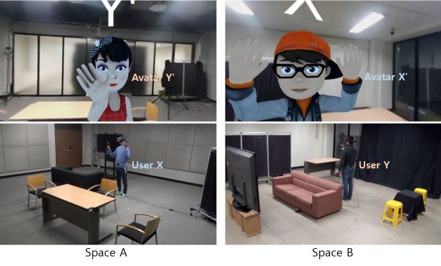
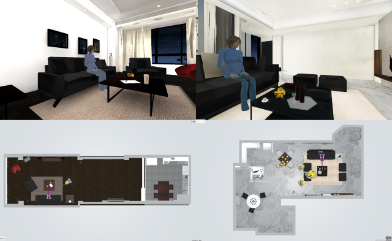

Placement Retargeting of Virtual Avatars to Dissimilar Indoor Environments
---------------------------------------------------------------------------------------------------------------------------------------

  

> **Placement Retargeting of Virtual Avatars to Dissimilar Indoor Environments** 

> IEEE TVCG, presented in IEEE ISMAR 2020 
> Paper: https://arxiv.org/abs/2012.11878 
> Project: http://motionlab.kaist.ac.kr/?page_id=6060 
> Video(method): https://www.youtube.com/watch?v=QIZJvcvW1qg&t=2s 
> Video(demo): https://www.youtube.com/watch?v=wwsWBeflVcU 

  

Data Visualization Application For Windows
---------------------------------------------------------------------------------------------------------------------------------------
https://drive.google.com/file/d/13PcQHmVxsHDgv_bbqmzMKffixaZOvAJL/view?usp=sharing

  

  

screenshot of user survey results
---------------------------------------------------------------------------------------------------------------------------------------
- 24 house pairs
- 36 questions per house pair

~/Houses/ : images of 8 houses

~/PairOfHouses/ : images of 24 house pairs

~/UserPlacements/Pair#/P#S% /: images of user placed avatars (# - pair number and % - scene number)
  

data
---------------------------------------------------------------------------------------------------------------------------------------
- 45d feature vectors
- feature_x_#.txt (# - pair number)

~/x/ : 1 feature vector from the placement of person X, repeated 110 times (rows) for each question (1 placement x 110 repeats x 36 questions = 3960 rows) to match 110 negative random samples.

~/pos/ : 10 feature vectors of Avatar X' placed by participants for each question repeated 11 times (10 answers x 11 repeats x 36 questions = 3960 rows).

~/neg/ : 110 feature vectors of randomly placed Avatar X' for each question (110 samples x 36 questions = 3960 rows).

